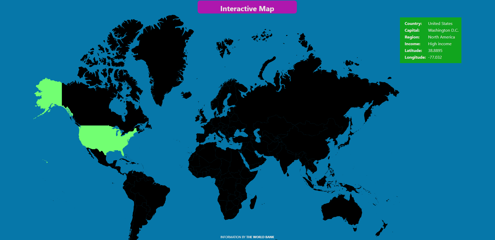

# 🗺️ Interactive World Map

An interactive world map web application that visualizes country-specific data using data sourced from **The World Bank**.  
Click on any country to view detailed information such as capital, region, income classification, and geographical coordinates.

Built using **[Angular CLI](https://github.com/angular/angular-cli) version 17.1.1.** and powered by **The World Bank** dataset.

---

## ✨ Features

✔ Interactive map with clickable countries  
✔ Displays real-time country information  
✔ Capital, region, income level, and geo-coordinates  
✔ Smooth UI transitions  
✔ Clean and minimalist design  
✔ Responsive for different screen sizes  
✔ Built with Angular 17

---

## 🖼 Screenshot

---

## 🛠 Tech Stack

- Angular 17
- TypeScript
- SCSS / CSS
- The World Bank Data
- SVG Map integration

---

## 🎯 Why This Project?

This project demonstrates:
- Real-world application of SVG and DOM manipulation
- Interactive map building using static data
- Clean structure with focus on data-driven UI
- User-friendly design and interaction
- Static dataset showcase from The World Bank

---

## 💡 Future Improvements

- Zoom & Pan functionality
- Enhanced mobile support
- Dynamic data fetching from live APIs
- Search & Filter countries
- Charts & historical data visualization

---

## Development server

Run `ng serve` for a dev server. Navigate to `http://localhost:4200/`. The application will automatically reload if you change any of the source files.

Navigate to http://localhost:4200/. The application will automatically reload if you change any of the source files.

---

## Code scaffolding

Run `ng generate component component-name` to generate a new component. You can also use `ng generate directive|pipe|service|class|guard|interface|enum|module`.

---

## Build

Run `ng build` to build the project. The build artifacts will be stored in the `dist/` directory.

---

## Running unit tests

Run `ng test` to execute the unit tests via [Karma](https://karma-runner.github.io).

---

## Running end-to-end tests

Run `ng e2e` to execute the end-to-end tests via a platform of your choice. To use this command, you need to first add a package that implements end-to-end testing capabilities.